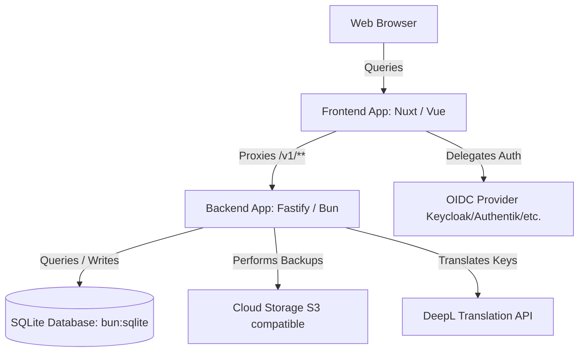

# glide. Comprehensive Setup & Configuration Guide

Welcome to the comprehensive setup and installation manual for **glide.**—a modern, containerized, state-of-the-art localization and translation management platform.

This guide provides step-by-step instructions to get glide. up and running successfully, whether for **local development** or **production-ready containerized deployment**. It covers all environment variables in detail to ensure a flawless first-time setup and prevent common issues with security, Single Sign-On (SSO), and database connections.

---

## 1. Architecture Overview

glide. is split into two primary, highly modular workspaces under a monorepo structure:



*   **Frontend Workspace (`apps/frontend`):** Built with Nuxt (Vue 3), Tailwind CSS, Nuxt UI, and `@vite-pwa/nuxt`. Powered by Nitro and optimized to run on **Bun**.
*   **Backend Workspace (`apps/backend`):** A high-performance Fastify REST API powered by **Bun**.
*   **Database & ORM:** Uses `bun:sqlite` with **Drizzle ORM** for lightweight, blazing-fast, serverless storage. No heavy PostgreSQL or MySQL servers are required.

> [!NOTE]
> Only the frontend needs a public domain — it proxies `/v1/**` to the backend server-side, so the backend can stay internal.

---

## 2. Environment Variables Directory

glide. is fully containerized. In production, **all configuration must be done directly via environment variables inside your `docker-compose.yml`**. Do **NOT** create `.env` files (project standards mandate container environment variables over static local files).

### 2.1 Backend Environment Variables (`apps/backend`)

These variables configure the Fastify server, SQLite database location, AI auto-translations, secrets encryption, and automated S3 backups.

| Variable | Default Value | Description | Required in Prod? |
| :--- | :--- | :--- | :---: |
| `PORT` | `3001` | The port the Fastify REST API listens on inside the container. | ❌ |
| `NODE_ENV` | `development` | Set to `production` for production deployments. Enables optimized logging and stricter validations. | ❌ |
| `DB_URL` | `data/db.sqlite` | The path to the SQLite database file. Under Docker, this must point to a persistent volume (e.g. `data/db.sqlite`). | **YES** |
| `DB_ENCRYPTION_KEY` | *(None)* | Cryptographic key used to encrypt/decrypt sensitive credentials in the DB (like Git Sync tokens). **Can be any string of any length**—if it's not a 32-byte string or 64-char hex, the backend automatically hashes it with SHA-256 under the hood to guarantee a valid 32-byte key. | **YES** |
| `S3_ENDPOINT` | *(None)* | S3-compatible cloud storage endpoint (MinIO, Cloudflare R2, AWS S3, etc.) for database backup zips. | ❌ (Disables cloud backups) |
| `S3_REGION` | `us-east-1` | S3 region for your backups bucket. | ❌ |
| `S3_BUCKET` | *(None)* | The target S3 bucket name where database backup zip files are uploaded. | ❌ (Required for S3) |
| `S3_ACCESS_KEY` | *(None)* | The S3 API Access Key ID. | ❌ (Required for S3) |
| `S3_SECRET_KEY` | *(None)* | The S3 API Secret Access Key. | ❌ (Required for S3) |

> [!CAUTION]
> **DB Encryption Key Safety:** Keep your `DB_ENCRYPTION_KEY` safe and never change it after configuring integrations! If you change or lose this key, the backend will be permanently unable to decrypt and read existing Git Sync access tokens, causing git operations to fail.

---

### 2.2 Frontend Environment Variables (`apps/frontend`)

These variables configure the Nuxt web application, OAuth2/OIDC SSO logins, and browser communication.

| Variable | Default Value | Description | Required in Prod? |
| :--- | :--- | :--- | :---: |
| `HOST` | `0.0.0.0` | The network interface the frontend server binds to inside the container. | ❌ |
| `PORT` | `3000` | The port the Nuxt application listens on. | ❌ |
| `NUXT_API_URL` | `http://localhost:3001` | Backend origin used server-side by the `/v1` proxy route. Not exposed to the browser (e.g. `http://backend:3001` in Docker). | **YES** |
| `NUXT_PUBLIC_OIDC_ENABLED` | `false` | Set to `true` to enable SSO/OIDC logins on the sign-in page. | ❌ |
| `NUXT_OIDC_PROVIDERS_OIDC_CLIENT_ID` | *(None)* | OIDC Client ID. | ❌ (Required for OIDC) |
| `NUXT_OIDC_PROVIDERS_OIDC_CLIENT_SECRET` | *(None)* | OIDC Client Secret. | ❌ (Required for OIDC) |
| `NUXT_OIDC_PROVIDERS_OIDC_AUTHORIZATION_URL`| *(None)* | Authorization endpoint of your OIDC Provider (e.g., Keycloak, Authentik, Okta). | ❌ (Required for OIDC) |
| `NUXT_OIDC_PROVIDERS_OIDC_TOKEN_URL` | *(None)* | Token exchange endpoint of your OIDC Provider. | ❌ (Required for OIDC) |
| `NUXT_OIDC_PROVIDERS_OIDC_REDIRECT_URI` | *(None)* | The exact callback URL registered in your OIDC provider (e.g., `https://glide.domain.com/auth/oidc/callback`). | ❌ (Required for OIDC) |
| `NUXT_OIDC_PROVIDERS_OIDC_USER_INFO_URL` | *(None)* | User Profile info endpoint of your OIDC Provider. | ❌ (Required for OIDC) |
| `NUXT_OIDC_SESSION_SECRET` | *(Auto-generated)* | Cryptographic signing secret for session cookies. **Fully auto-generated with a secure random 64-char hex string on startup if not provided!** If you do provide a custom string but it is under 48 characters, glide.'s runtime Nitro plugin automatically hashes it with SHA-512 to guarantee a valid length and prevent 500 errors. | ❌ (Auto-generated) |
| `NUXT_OIDC_AUTH_SESSION_SECRET` | *(Auto-generated)* | Cryptographic secret for browser auth flow sessions. **Fully auto-generated with a secure random 64-char hex string on startup if not provided!** If you do provide a custom string but it is under 48 characters, it is automatically hashed with SHA-512 to ensure a secure, valid length. | ❌ (Auto-generated) |
| `NUXT_OIDC_TOKEN_KEY` | *(Auto-generated)*| Base64-encoded token encryption key. | ❌ (Auto-generated if blank) |

> [!TIP]
> **Runtime Auto-Generation & Auto-Hashing Protection:** `nuxt-oidc-auth` strictly requires session and auth secrets to be at least **48 characters long** to prevent session hijack. To make deployment completely error-free and out-of-the-box ready, glide. includes a **runtime Nitro server plugin** (`apps/frontend/server/plugins/oidc-secrets.ts`) that runs during container initialization.
> 
> If you leave these variables blank, they are **fully auto-generated with cryptographically secure random values on startup**. If you do provide secrets in your `docker-compose.yml` but they are too short (less than 48 characters), they are automatically hashed with SHA-512 on startup before the server binds, ensuring a robust, secure, and crash-free deployment!

---

## 3. Automated Database Migrations

You **never** need to run database migration scripts manually!

glide. is configured to handle schema definitions as code. During the startup of the backend container, the command `bunx drizzle-kit push --force` is executed using the `@libsql/client` driver.

- This compares the current `apps/backend/src/db/schema.ts` definition against the SQLite table structures on startup.
- It applies any incremental structural changes (adding tables, rows, columns, references) **safely and automatically** without human intervention.
- Your existing translation data is fully preserved.

---

## 4. Production Docker Deployment

Deploying glide. is straightforward. Create a `docker-compose.yml` file in your server directory.

We offer two main deployment flows:

### Option A: Using Pre-Built Images (Recommended for Production)

This configures glide. using official, optimized images pulled from GitHub Container Registry:

```yaml
version: '3.8'

services:
  backend:
    image: ghcr.io/marl0nx/glidedot-backend:latest
    container_name: glide-backend
    restart: unless-stopped
    ports:
      - "3001:3001"
    volumes:
      - glide_data:/app/data
    environment:
      - PORT=3001
      - NODE_ENV=production
      - DB_URL=data/db.sqlite
      # Encryption Key for Secrets (Tokens, API Keys). Keep this safe!
      - DB_ENCRYPTION_KEY=0123456789abcdef0123456789abcdef0123456789abcdef0123456789abcdef
      # Optional: Automated S3 Backup Configuration
      - S3_ENDPOINT=https://your-s3-provider.com
      - S3_REGION=us-east-1
      - S3_BUCKET=glide-backups
      - S3_ACCESS_KEY=your_access_key
      - S3_SECRET_KEY=your_secret_key

  frontend:
    image: ghcr.io/marl0nx/glidedot-frontend:latest
    container_name: glide-frontend
    restart: unless-stopped
    ports:
      - "3000:3000"
    environment:
      - HOST=0.0.0.0
      - PORT=3000
      - NODE_ENV=production
      - NUXT_API_URL=http://backend:3001
      # Cryptographically secure 48+ character secrets
      - NUXT_OIDC_SESSION_SECRET=secure_session_secret_at_least_48_characters_long_for_security_reasons_123
      - NUXT_OIDC_AUTH_SESSION_SECRET=secure_auth_session_secret_at_least_48_characters_long_for_security_reasons_123
      # Optional: OIDC OAuth SSO Configuration
      - NUXT_PUBLIC_OIDC_ENABLED=false
      - NUXT_OIDC_PROVIDERS_OIDC_CLIENT_ID=your_client_id
      - NUXT_OIDC_PROVIDERS_OIDC_CLIENT_SECRET=your_client_secret
      - NUXT_OIDC_PROVIDERS_OIDC_AUTHORIZATION_URL=https://sso.yourdomain.com/auth
      - NUXT_OIDC_PROVIDERS_OIDC_TOKEN_URL=https://sso.yourdomain.com/token
      - NUXT_OIDC_PROVIDERS_OIDC_USER_INFO_URL=https://sso.yourdomain.com/userinfo
      - NUXT_OIDC_PROVIDERS_OIDC_REDIRECT_URI=https://glide.yourdomain.com/auth/oidc/callback
    depends_on:
      - backend

volumes:
  glide_data:
```

### Option B: Building from Local Source (Recommended for Local Customization)

This builds the containers locally using Multi-stage builds and runs with hot-reloading:

```yaml
version: '3.8'

services:
  backend:
    image: oven/bun:1-alpine
    container_name: glide-backend
    restart: always
    working_dir: /app
    volumes:
      - glide_data:/app/data
      - .:/app
    ports:
      - "3001:3001"
    environment:
      - NODE_ENV=production
      - PORT=3001
      - DB_URL=data/db.sqlite
      - DB_ENCRYPTION_KEY=0123456789abcdef0123456789abcdef0123456789abcdef0123456789abcdef
    command: sh -c "bun install && bunx drizzle-kit push --force && bun run src/index.ts"

  frontend:
    image: oven/bun:1-alpine
    container_name: glide-frontend
    restart: always
    working_dir: /app
    ports:
      - "3000:3000"
    volumes:
      - .:/app
    environment:
      - NUXT_API_URL=http://backend:3001
      - NUXT_OIDC_SESSION_SECRET=secure_session_secret_at_least_48_characters_long_for_security_reasons_123
      - NUXT_OIDC_AUTH_SESSION_SECRET=secure_auth_session_secret_at_least_48_characters_long_for_security_reasons_123
    command: sh -c "bun install && bun run build && bun run dev"

volumes:
  glide_data:
    driver: local
```

### 4.1 Deploying the Stack

Run the following command to download, build, and start the services in detached mode:
```bash
docker-compose up -d --build
```

### 4.2 Performing a Clean Wipe / Reset
If you want to perform a complete factory reset, wiping out the SQLite database, users, and all settings:
```bash
docker-compose down -v
```
> [!CAUTION]
> This command will permanently delete the persistent volume `glide_data`. Your translation data cannot be recovered unless an external backup is available.

---

## 5. Local Development Setup (No Docker)

To run glide. locally on your machine for development or testing:

### 5.1 Prerequisites
- **Bun Package Manager:** Make sure you have [Bun](https://bun.sh/) installed. Do **NOT** use `npm`, `yarn`, or `pnpm` (project standard).
  ```bash
  # To install Bun (macOS/Linux)
  curl -fsSL https://bun.sh/install | sh
  ```

### 5.2 Installation
Clone the repository and install all dependencies in the workspace root:
```bash
git clone https://github.com/marl0nx/glidedot.git
cd glidedot

# Install dependencies for both frontend and backend automatically
bun install
```

### 5.3 Starting Dev Servers
To run both the frontend and backend servers concurrently with hot-reloading:
```bash
# Start turbo-charged monorepo dev servers from the root
bun run dev
```

> [!NOTE]
> *   **Frontend** runs at [http://localhost:3000](http://localhost:3000)
> *   **Backend API** runs at [http://localhost:3001](http://localhost:3001)

---

## 6. Setup Troubleshooting

### 1. Error: "OIDC Login fails with 500 Internal Server Error"
*   **Solution:** Check that the Redirect URL (`NUXT_OIDC_PROVIDERS_OIDC_REDIRECT_URI`) registered in your OAuth Provider matches the public URL of your glide. instance exactly, including the trailing `/auth/oidc/callback` path. Ensure your session secrets are long and secure.

### 2. Error: "Failed to connect to S3 Bucket"
*   **Solution:** Verify that your S3 endpoint does not end with a trailing slash and includes `https://` (e.g. `https://s3.amazonaws.com`). Check that the bucket has already been created in your storage provider.

### 3. Error: "Auto-Translation key does not show suggestions"
*   **Solution:** Check if your DeepL API Key is entered correctly under **Admin General Settings** inside the dashboard, and ensure your DeepL monthly character quota has not been exceeded.
